# 🚗 # 🚗 Car Rental Management System (MERN Stack | JWT Auth | Rental Workflow)

A full-stack web application to manage vehicle rentals, customers, and booking history with real-time availability tracking.

---

## 📌 Features

* 🚘 Add, view, and manage vehicles
* 👤 Customer management system
* 📅 Rent and return vehicles
* 📊 Rental history tracking
* 🔐 Authentication using JWT
* ⏳ Loading states for better UX
* 🚫 Conditional actions (e.g., disable remove when vehicle is active)

---

## 🛠️ Tech Stack

**Frontend:**

* React.js
* Tailwind CSS

**Backend:**

* Node.js
* Express.js

**Database:**

* MongoDB

---

## ⚙️ Installation & Setup

### 1. Clone the repository

```bash
git clone https://github.com/premkumarpalo/car-rental.git
cd RentalManagementSystem
```

### 2. Backend setup

```bash
cd backend
npm install
```

Create a `.env` file inside backend:

```
MONGO_URI=your_mongodb_connection_string
ACCESS_TOKEN_SECRET=your_secret_key
PORT=8000
```

Run backend:

```bash
npm run dev
```

---

### 3. Frontend setup

```bash
cd frontend
npm install
npm run dev
```

---

## 📸 Screenshots

### Active DashBoard
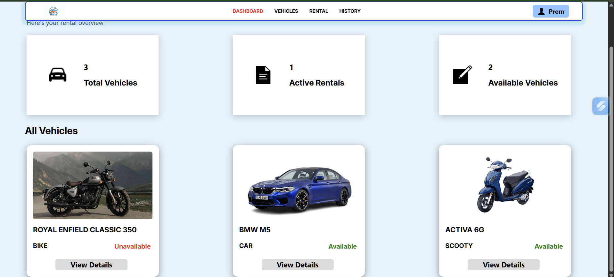

### Dashboard
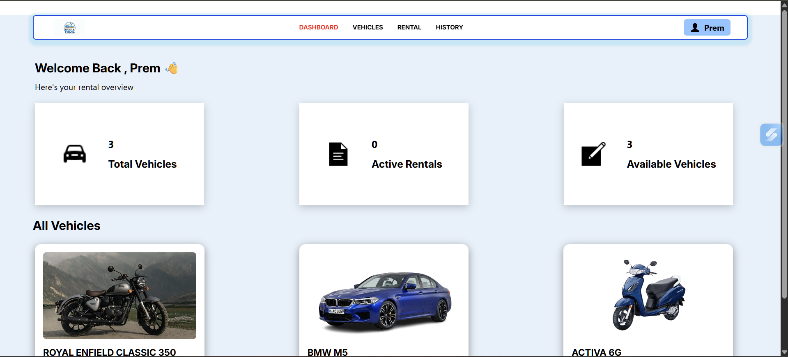

### Active Rental
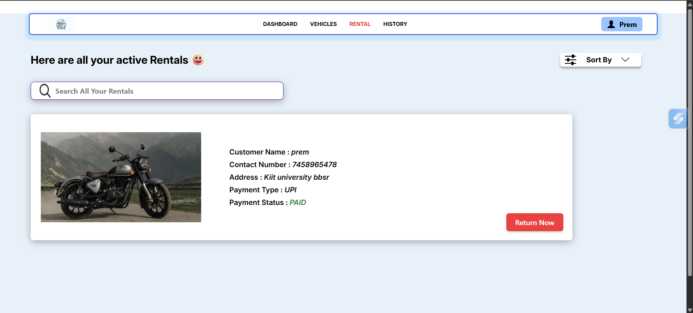

### Active Vehicles
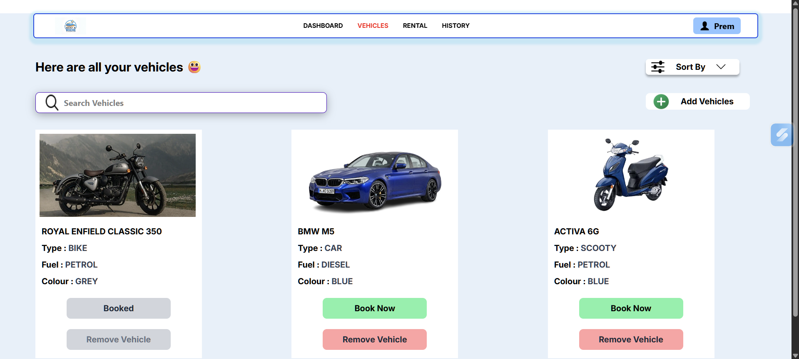

### Add Vehicle
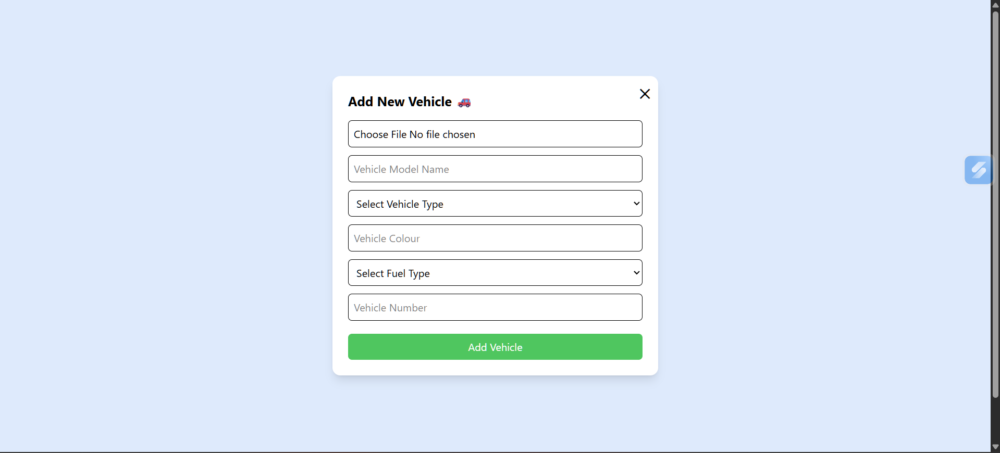

### Billing Page
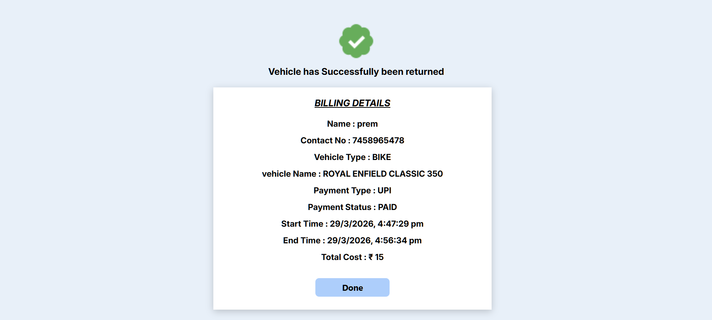

### Booking
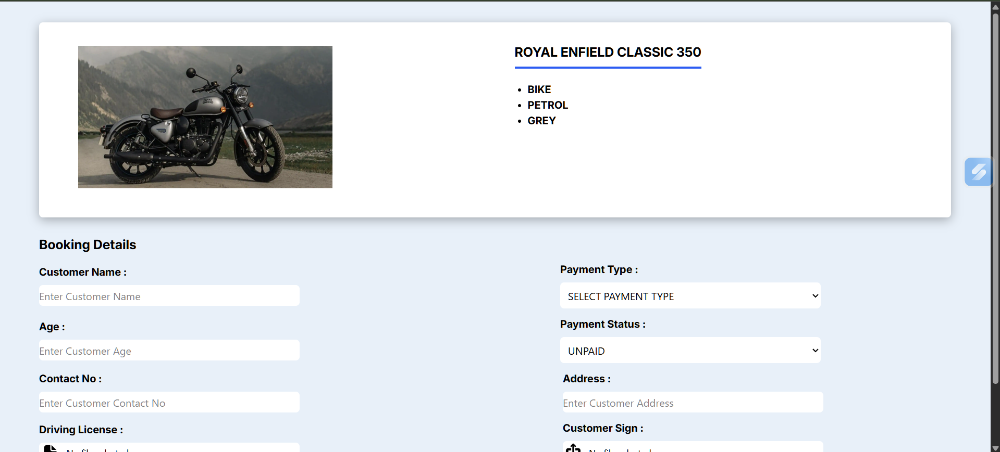

### History Page
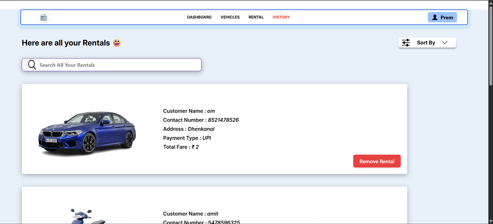

### Login Page
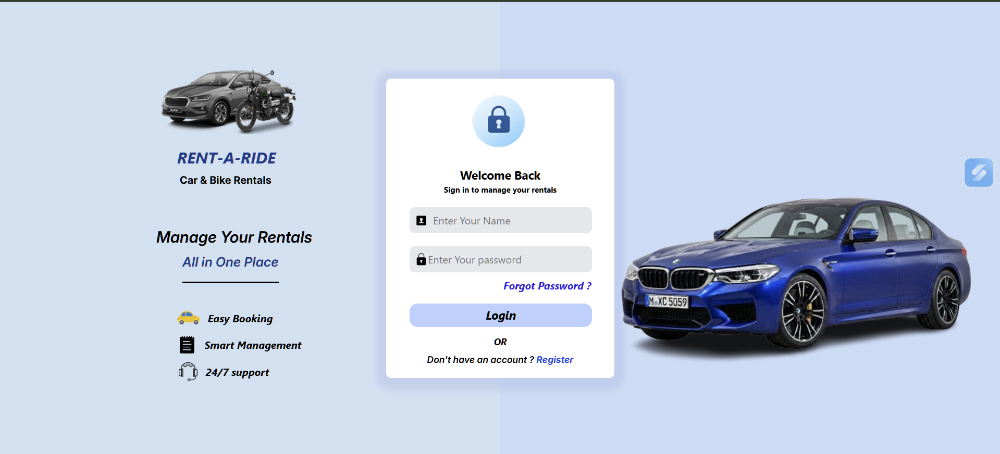

### Register Page
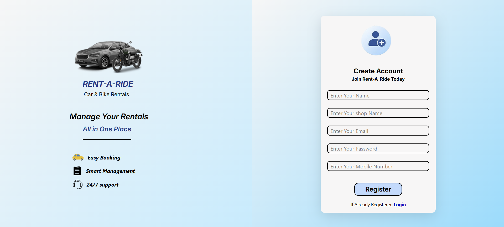

### Remove Vehicle
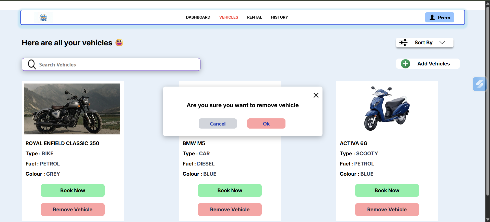

### Rental Page
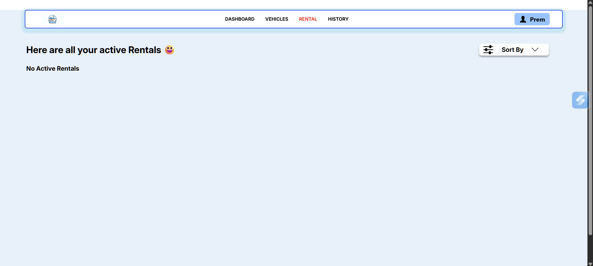

### Success Page
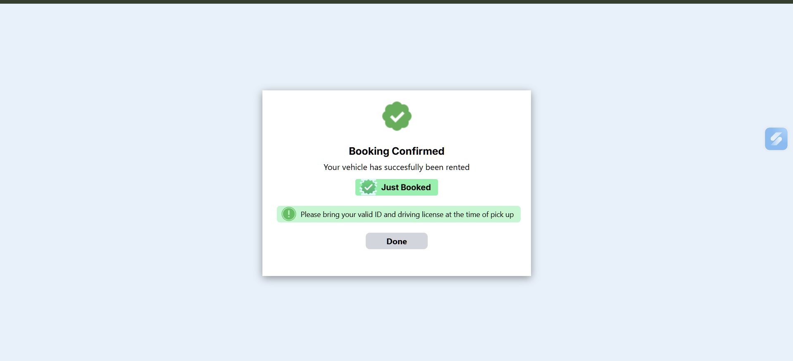

### Vehicle Page
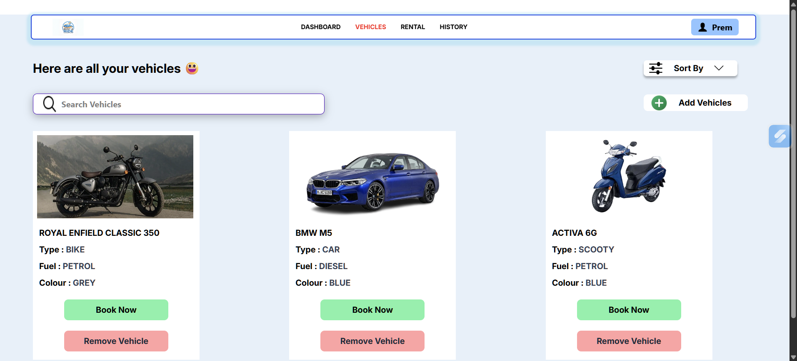

---

## 🚀 Future Improvements (V2)

* Edit customer details
* Search & filter functionality
* Role-based access (Admin/User)
* UI enhancements (toasts, modals)

---

## 🙌 Author

**Prem Kumar Palo**

* GitHub: https://github.com/your-username
* LinkedIn: https://www.linkedin.com/in/prem-kumar-palo-a5b83627a/

---

## ⭐ Acknowledgment

This project was built as part of a full-stack development journey to understand real-world application architecture and to automate rental management systems.
